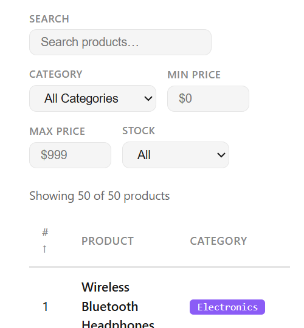
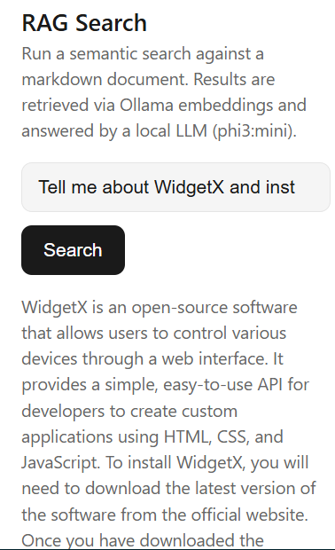

# Markdown Viewer MCP

A Model Context Protocol (MCP) server that ingests and displays markdown files through four creative, interactive view modes: Magazine, Reader, Slides, and Dashboard.

## Table of Contents

- [Project Overview](#project-overview)
- [Prerequisites](#prerequisites)
- [Quick Start](#quick-start)
- [Setup](#setup)
- [Installation](#installation)
- [Running](#running)
- [Features](#features)
- [Configuration](#configuration)
- [MCP Server Integration](#mcp-server-integration)
- [Project Structure](#project-structure)
- [Troubleshooting](#troubleshooting)

---

## Project Overview

**markdown-viewer-mcp** is a Model Context Protocol (MCP) server that transforms how you explore and present markdown files. It combines:

- **Backend**: Express.js server implementing the MCP specification
- **Frontend**: React application with Vite build tool providing interactive UI
- **RAG Engine**: Vector-based retrieval-augmented generation for intelligent search and content association
- **AI Integration**: Ollama support for local LLM processing

The server ingests markdown files, extracts semantic information, and exposes them through a powerful `view-markdown` tool. This tool presents documents in four distinct, context-appropriate visualization modes: Magazine (card overview), Reader (detailed markdown), Slides (presentation), and Dashboard (statistics).

**Use Case**: When an MCP client (like Claude) needs to explore your documentation, it can call the `view-markdown` tool with file paths, and users get a rich, interactive experience rather than raw text.


## Prerequisites

This server supports two usage scenarios with different prerequisites:

### Scenario I: Product Search (Simple Markdown Viewer)

**Use Case**: View and explore markdown files with Magazine, Reader, Slides, and Dashboard modes. No AI/RAG features.

**Required**:
- **Node.js** (v18.0.0 or higher)
  - Download from [nodejs.org](https://nodejs.org/)
  - Verify: `node --version`

- **npm** (v9.0.0 or higher, included with Node.js)
  - Verify: `npm --version`

**Optional**:
- **Git** (for version control)

---

### Scenario II: RAG Search (AI-Powered with Vector Search)

**Use Case**: Full-featured markdown exploration with semantic search, vector embeddings, and AI-powered content processing.

**Required**:
- **Node.js** (v18.0.0 or higher)
  - Download from [nodejs.org](https://nodejs.org/)

- **npm** (v9.0.0 or higher)

- **Ollama** (for vector embeddings)
  - Download from [ollama.ai](https://ollama.ai/)
  - Install model: `ollama pull embeddinggemma`
  - Must be running during ingest and query operations

- **Foundry** (for AI processing)
  - Download from [Foundry docs](https://foundry.microsoft.com/)
  - Install model: `foundry model pull qwen2.5-0.5b`
  - Required for intelligent content processing and AI features

**Optional**:
- **Git** (for version control)

---

## Quick Start

Choose your scenario:

### Scenario I: Product Search (Simple)

```bash
# Navigate to the main application
cd markdown-viewer-mcp

# Install dependencies
npm install

# Build and start the server
npm start
```

The server starts on `http://localhost:3004/mcp`. 

**Next**: Open GitHub Copilot chat and paste:

```sh
#search-products you MUST call a tool
```

This invokes the `mcp_markdown-view_search-products` tool through GitHub Copilot chat. Use it to search the product catalog markdown and return filtered product results.

You should see the following UI:

- 


### Scenario II: RAG Search (Full AI Features)

```bash
# Navigate to the main application
cd markdown-viewer-mcp

# Install dependencies
npm install

# Prepare Ollama with embedding model
ollama pull embeddinggemma

# Prepare Foundry with AI model
foundry model pull qwen2.5-0.5b

# Ingest markdown files (defaults to markdown-viewer-mcp/docs/sample.md)
npm run ingest

# Build and start the server
npm start
```

The server starts on `http://localhost:3004/mcp`. Full RAG capabilities with semantic search and AI processing are now available.

By default, `npm run ingest` ingests the bundled sample file at `markdown-viewer-mcp/docs/sample.md`.

**Next**: Open GitHub Copilot chat and paste:

```sh
#rag-search you MUST call a tool
```

Next type the following query to test RAG search:

```text
Tell me about WidgetX and install instructions
```



## Setup

### 1. Navigate to the Application Directory

```bash
cd markdown-viewer-mcp
```

### 2. Verify Prerequisites

```bash
node --version    # Should be v18.0.0 or higher
npm --version     # Should be v9.0.0 or higher
```

### 3. Review Project Structure

```text
markdown-viewer-mcp/
├── src/                           # React frontend components
│   ├── MarkdownViewer.tsx        # Main viewer component
│   ├── global.css                # Global styles
│   └── vite-env.d.ts            # Vite environment types
├── docs/                          # Sample markdown files
│   └── sample.md
├── main.ts                        # MCP server entry point
├── server.ts                      # MCP server implementation
├── ingest.ts                      # Markdown ingestion logic
├── rag.ts                         # RAG (Retrieval-Augmented Generation)
├── ai.ts                          # AI/Ollama integration
├── tsconfig.json                  # TypeScript configuration
├── vite.config.ts                 # Vite build configuration
├── package.json                   # Dependencies
└── vector_store.json              # Vector database for RAG
```

## Installation

### Install Dependencies

```bash
npm install
```

This installs all required packages including:
- MCP SDK and extensions (`@modelcontextprotocol/sdk`)
- Express web server
- React and React DOM
- TypeScript and build tools (Vite, tsx)
- Supporting libraries (marked, cors, zod, etc.)

### Verify Installation

```bash
npm run build
```

This compiles TypeScript and builds the frontend. Should complete with no errors.

---

---

## Running

Choose the scenario that matches your use case:

### Scenario I: Product Search (No RAG)

Simply install and start:

```bash
npm install
npm start
```

- **No ingestion needed** — browse markdown files directly
- **No Ollama/Foundry required**
- Basic view modes: Magazine, Reader, Slides, Dashboard
- Fast startup

---

### Scenario II: RAG Search (With AI Features)

#### Step 1: Install Dependencies

```bash
npm install
```

#### Step 2: Prepare Ollama & Foundry

Ensure Ollama is installed and running, then pull the embedding model:

```bash
ollama pull embeddinggemma
```

Ensure Foundry is installed and pull the AI model:

```bash
foundry model pull qwen2.5-0.5b
```

**Note**: Both Ollama and Foundry must remain running during ingestion and server operation.

#### Step 3: Ingest Markdown Files

```bash
npm run ingest
```

This step:
- Defaults to the bundled sample file: `markdown-viewer-mcp/docs/sample.md`
- Reads markdown files from your project
- Uses Ollama (`embeddinggemma`) to create vector embeddings
- Populates `vector_store.json` (vector database)
- Enables semantic search and RAG queries
- **Required before starting server for RAG features**

#### Step 4: Start the Server

```bash
npm start
```

This will:
1. Build TypeScript code (`npm run build`)
2. Start the MCP server (`npm run serve`)
3. Listen on `http://localhost:3004/mcp`
4. Ready to receive `view-markdown` requests with RAG capabilities

---

### Other Commands

**Build Only** (compile without running):
```bash
npm run build
```

**Development Server Only** (without building):
```bash
npm run serve
```

---

## Features

### Interactive View Modes (Available in Both Scenarios)

| Mode | Description |
|------|-------------|
| 📰 **Magazine** | Card grid with colour-coded banners, excerpts, word counts, and badges. Click cards to explore. |
| 📖 **Reader** | Full rendered markdown with floating table-of-contents sidebar. |
| 🎬 **Slides** | Presentation mode — each H1/H2 becomes a navigable slide (keyboard arrow support). |
| 📊 **Dashboard** | Aggregate statistics across all documents with comparative word count charts. |

### Scenario I: Product Search Features

- **Fast browsing** — No ingestion required
- **Multiple view modes** — Magazine, Reader, Slides, Dashboard
- **CORS Enabled** — Cross-origin requests supported
- **Rate Limiting** — 100 requests per minute per IP
- **Type Safety** — Full TypeScript with strict mode
- **React Frontend** — Modern interactive UI with Vite

### Scenario II: RAG Search Features (Additional)

- **Vector Embeddings** — Semantic understanding via `embeddinggemma`
- **RAG Support** — Retrieval-augmented generation for intelligent search
- **AI Integration** — Ollama for local embedding generation
- **Foundry Integration** — LLM-powered content processing
- **Vector Store** — Persistent `vector_store.json` for fast queries
- **Semantic Search** — Find relevant content based on meaning, not keywords

---

## Configuration

### Environment Variables

| Variable | Default | Description |
|----------|---------|-------------|
| `PORT` | `3004` | HTTP server port for MCP server |

### Setting Environment Variables

```bash
# PowerShell (Windows)
$env:PORT=5000
npm start

# Bash/Linux/macOS
export PORT=5000
npm start
```

### Build Configuration

- **TypeScript**: `tsconfig.json` with strict type checking
- **Vite**: `vite.config.ts` for optimized React builds
- **Server**: `tsconfig.server.json` for Node.js runtime

---

## MCP Server Integration

### Tool: `view-markdown`

Expose markdown files to MCP hosts for interactive viewing.

**Input:**
- `filePaths` (string[]) — Array of file paths to markdown files

**Output:**
- Document count, total word count, and reading time
- Interactive viewer supporting all four view modes

### Adding to MCP Hosts

To use this server with an MCP host (e.g., Claude Desktop):

```json
{
  "mcpServers": {
    "markdown-viewer-mcp": {
      "command": "npm",
      "args": ["start"],
      "cwd": "/path/to/markdown-viewer/markdown-viewer-mcp"
    }
  }
}
```

### Example Usage

Through an MCP host, request:

```
"View my markdown files at ./docs/intro.md and ./docs/guide.md"
```

The server will display an interactive viewer with all four visualization modes.

---

## Project Structure

```
markdown-viewer-mcp/
├── src/                          # React frontend
│   ├── MarkdownViewer.tsx       # Main viewer component
│   ├── global.css               # Global styles
│   └── vite-env.d.ts
├── docs/                         # Sample markdown files
│   └── sample.md
├── main.ts                       # Server entry point
├── server.ts                     # MCP server implementation
├── ingest.ts                     # Markdown ingestion
├── rag.ts                        # RAG functionality
├── ai.ts                         # AI/Ollama integration
├── package.json                  # Dependencies and scripts
├── tsconfig.json                 # TypeScript config
├── vite.config.ts                # Vite build config
├── README.md                     # Detailed documentation
└── vector_store.json             # Vector database for RAG
```

---

## Troubleshooting

### Build Fails

```bash
# Clear and reinstall dependencies
rm -r node_modules package-lock.json
npm install
npm run build
```

### Port Already in Use

```bash
# Use a different port
$env:PORT=3005  # PowerShell
# OR
export PORT=3005  # Bash

npm start
```

### TypeScript Errors

```bash
# Update TypeScript to latest
npm install typescript@latest --save-dev
npm run build
```

### Server Won't Start

1. Verify Node.js and npm versions: `node --version && npm --version`
2. Check dependencies installed: `npm list`
3. Rebuild from scratch:
   ```bash
   npm run build
   npm run serve
   ```

---

## License

MIT

---

## Next Steps

- Review [markdown-viewer-mcp/README.md](markdown-viewer-mcp/README.md) for detailed feature documentation
- Add your own markdown files to explore with the four view modes
- Configure for your MCP host (Claude Desktop, etc.)
- Explore RAG capabilities with `npm run ingest`
